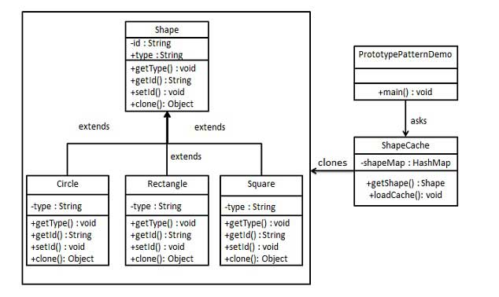

Prototype pattern refers to creating duplicate object while keeping performance in mind. This type of design pattern comes under creational pattern as this pattern provides one of the best ways to create an object.

This pattern involves implementing a prototype interface which tells to create a clone of the current object. This pattern is used when creation of object directly is costly. For example, an object is to be created after a costly database operation. We can cache the object, returns its clone on next request and update the database as and when needed thus reducing database calls.

# Implementation
We're going to create an abstract class Shape and concrete classes extending the Shape class. A class ShapeCache is defined as a next step which stores shape objects in a Hashtable and returns their clone when requested.

PrototypPatternDemo, our demo class will use ShapeCache class to get a Shape object.

